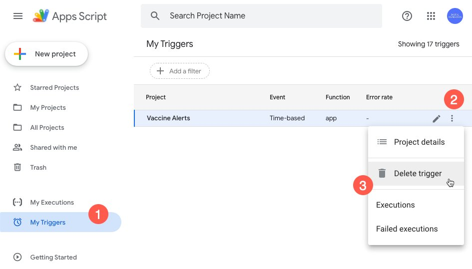

# COVID-19 Vaccine Tracker (India)

👉🏻 [How to Use Covid-19 Vaccine Tracker](https://www.labnol.org/covid19-vaccine-tracker-210501)

🇮🇳 Get email alerts when COVID-19 Vaccines are available in your city / district in India. The tracker can check availability of both COVAXIN and COVISHIELD vaccines.

## Disable Email Alerts for Vaccine ❎

👉🏻  [How to Stop Vaccine Alerts](https://twitter.com/labnol/status/1394525661767757825)

If you have been vaccinated and would like the vaccine tracker to stop sending you email alerts, here are the steps:

1. Go to https://script.google.com/home/triggers
2. Click the 3-dot menu near the Vaccine Alerts project in the list.
3. Click Delete Trigger from the menu.

